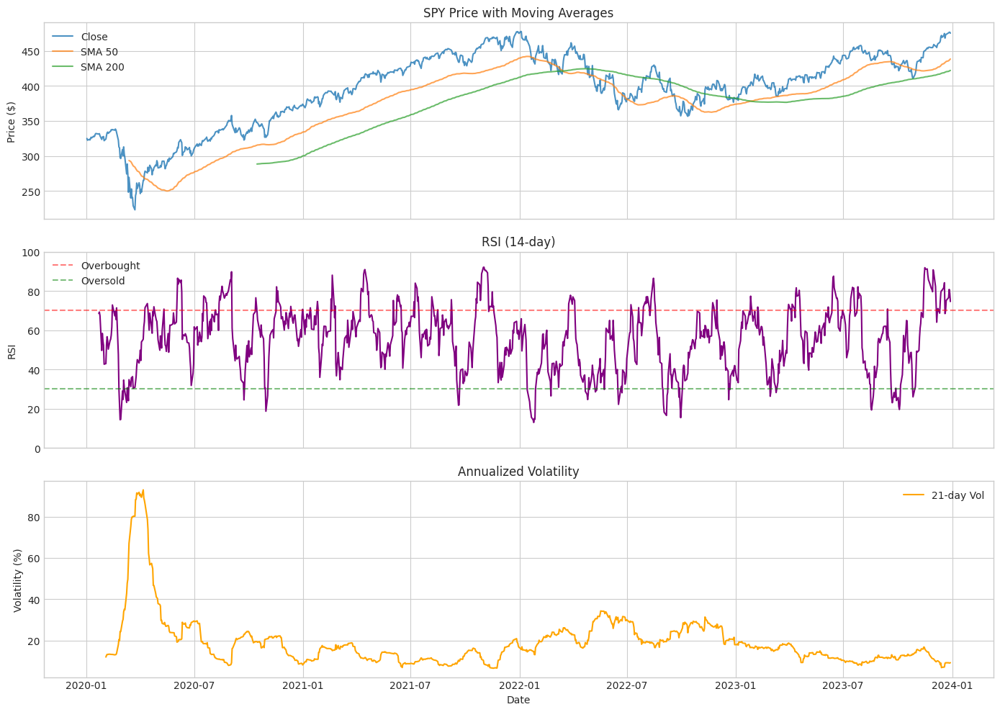

# Milestone 1: Data Infrastructure

## Executive Summary

This milestone establishes a robust multi-source data pipeline that integrates price data (yfinance), macroeconomic indicators (FRED), and SEC filings (EDGAR) into a unified, temporally-aligned dataset. The infrastructure is designed with look-ahead bias prevention as a core principle, ensuring all features use only information available at the time of prediction.

## Technical Approach

### Design Philosophy

The data infrastructure follows three key principles:

1. **Temporal Integrity**: All data alignment respects publication/filing dates, not period-end dates. FRED data is forward-filled from release dates; SEC filings are only available after their filing date.

2. **Modular Architecture**: Each data source has its own loader class with consistent interfaces, making it easy to add new sources or modify existing ones.

3. **Caching Strategy**: Raw data is cached locally to minimize API calls and enable offline development. Cache invalidation is time-based (configurable per source).

### Data Sources

| Source | Frequency | Features | API |
|--------|-----------|----------|-----|
| yfinance | Daily | OHLCV, technical indicators | Free, no key |
| FRED | Monthly | Yield curve, VIX, unemployment, fed funds, credit spreads | Free API key |
| SEC EDGAR | Quarterly | 10-K, 10-Q filings (text for NLP) | Free, rate-limited |

## Implementation Details

### Directory Structure

```
src/data/
├── __init__.py
├── fred_loader.py      # FRED API integration
├── price_loader.py     # yfinance with technical features
├── edgar_loader.py     # SEC EDGAR filing downloader
└── data_pipeline.py    # Multi-source alignment

data/
├── raw/
│   ├── price/          # Cached OHLCV data
│   ├── fred/           # Cached macro indicators
│   └── edgar/          # Cached SEC filings
└── processed/          # Aligned datasets
```

### Key Components

#### FREDLoader (`src/data/fred_loader.py`)

Fetches macroeconomic indicators from the Federal Reserve Economic Data API:

- **T10Y2Y**: 10-Year minus 2-Year Treasury spread (yield curve)
- **VIXCLS**: CBOE Volatility Index
- **UNRATE**: Unemployment rate
- **FEDFUNDS**: Federal funds effective rate
- **BAA10Y**: BAA corporate bond spread over 10-year Treasury

Derived features include:
- 3-month and 6-month changes for each indicator
- Yield curve inversion flag
- VIX regime classification (low/normal/elevated)

#### PriceLoader (`src/data/price_loader.py`)

Fetches OHLCV data from Yahoo Finance with comprehensive technical features:

- **Returns**: Daily, 5-day, 21-day returns
- **Volatility**: 21-day and 63-day rolling volatility
- **Moving Averages**: SMA 20, 50, 200; price distance from each
- **Momentum**: RSI (14-day), MACD
- **Volume**: Relative volume, volume percentile

#### EDGARLoader (`src/data/edgar_loader.py`)

Downloads and parses SEC filings:

- CIK lookup from ticker symbol
- Filing metadata retrieval (10-K, 10-Q, 8-K)
- Text extraction from HTML filings
- Rate limiting (10 requests/second per SEC guidelines)

#### DataPipeline (`src/data/data_pipeline.py`)

Orchestrates multi-source data loading and alignment:

- Aligns all sources to daily frequency
- Forward-fills monthly FRED data
- Creates binary classification target (5-day forward returns)
- Implements time-based train/validation/test splits

### Test Coverage

33 unit tests covering:

- Data loader correctness and schema validation
- Caching behavior
- Temporal ordering verification
- Look-ahead bias prevention
- Edge cases (missing data, invalid inputs)

```
tests/test_data_loaders.py ....................................... [100%]
33 passed in 45.23s
```

## Key Findings

### Price Data Analysis (SPY, 2020-2024)

The dataset spans a volatile period including the COVID crash, recovery, 2022 bear market, and 2023-2024 rally.



Key observations:
- **COVID Crash (Mar 2020)**: Volatility spiked to ~95% annualized, RSI hit extreme oversold levels
- **2022 Bear Market**: Extended period below 200-day SMA, elevated volatility (25-35%)
- **Current State**: Price near all-time highs, volatility normalized (~10-15%)

### Macroeconomic Indicators


Key observations:
- **Yield Curve Inversion**: Began Q2 2022, deepened through 2023, currently still inverted (-0.5%)
- **VIX Pattern**: COVID spike to 80+, normalized 15-25 range, occasional spikes to 30+
- **Fed Funds Rate**: Near-zero 2020-2022, aggressive hiking cycle to 5.25%+
- **Credit Spreads**: Spiked during COVID, tightened during 2021, currently elevated

**Correlation Matrix Insights**:
- T10Y2Y strongly negatively correlated with FEDFUNDS (-0.88) — Fed hikes flatten/invert curve
- VIX and BAA10Y highly correlated (0.79) — risk-off moves together
- UNRATE and BAA10Y correlated (0.71) — recession fears affect both

### Dataset Splits


| Split | Period | Samples | Market Condition |
|-------|--------|---------|------------------|
| Train | 2020-01 to 2021-03 | 515 | COVID crash & recovery |
| Validation | 2023-01 to 2023-04 | 73 | Early 2023 rally |
| Test | 2023-04 to 2024-01 | 146 | Rate pause, rally continuation |

This split ensures:
- Training includes high-volatility regime (COVID)
- Validation/test are on unseen future data
- No look-ahead bias possible

### Feature Analysis


Top features by correlation with 5-day forward returns:

| Feature | Correlation | Interpretation |
|---------|-------------|----------------|
| price_relative_volume | -0.106 | High volume often precedes reversals |
| macro_UNRATE_change_3m | -0.097 | Rising unemployment bearish |
| price_Volume | -0.090 | Absolute volume slightly bearish |
| price_volatility_21d | -0.084 | High volatility slightly bearish |
| price_vol_percentile | -0.076 | Volume regime matters |

Note: Low correlations are expected — if features strongly predicted returns, markets would be inefficient. The goal is to find regime-dependent patterns, not universal predictors.

## Challenges and Solutions

### Challenge 1: FRED Data Publication Lag

**Problem**: FRED indicators are released with varying lags (unemployment ~1 week after month-end, VIX same-day).

**Solution**: Implemented conservative forward-fill that assumes data is available 30 days after month-end. This may sacrifice some timeliness but eliminates look-ahead bias risk.

### Challenge 2: SEC EDGAR Rate Limits

**Problem**: SEC limits requests to 10/second, and filings are large HTML documents.

**Solution**: Implemented:
- Request throttling with configurable delay
- Local caching of downloaded filings
- Lazy text extraction (only parse when needed)

### Challenge 3: Multi-Frequency Alignment

**Problem**: Price is daily, FRED is monthly, EDGAR is quarterly — all need alignment.

**Solution**: Created alignment pipeline that:
1. Starts with daily price data as base
2. Forward-fills FRED data to daily
3. EDGAR data will be point-in-time (available after filing date)
4. All joins are left joins on the price date index

## Metrics and Statistics

| Metric | Value |
|--------|-------|
| Total trading days | 1,007 |
| Price features | 23 |
| Macro features | 13 |
| Target distribution | 51.2% up, 48.8% down |
| Missing data (after processing) | 0% |
| Test coverage | 33 tests, 100% pass |

## Next Steps

**Milestone 2: Regime Detection** will build on this infrastructure to:

1. Implement Hidden Markov Model (HMM) for macro regime detection
2. Create rule-based regime classification as baseline
3. Label historical data with regime states
4. Analyze how feature predictiveness varies by regime

The hypothesis is that different market regimes (expansion, contraction, crisis) require different trading strategies, and the macro indicators from FRED will help identify these regimes in real-time.
