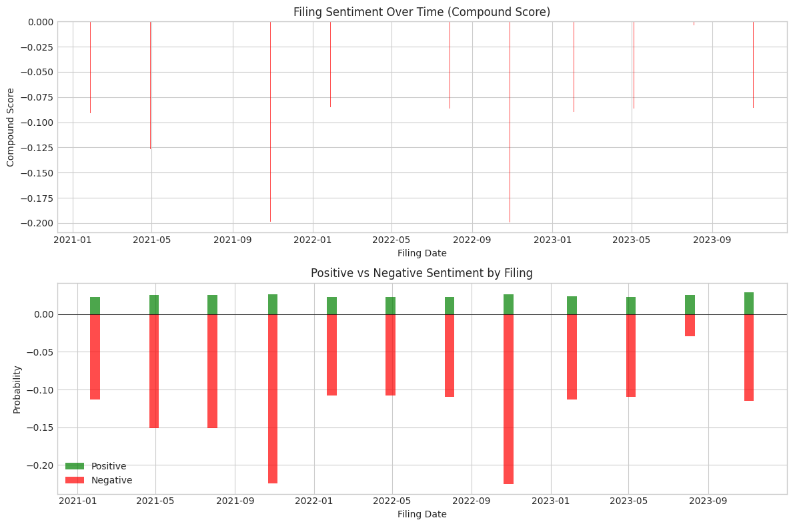
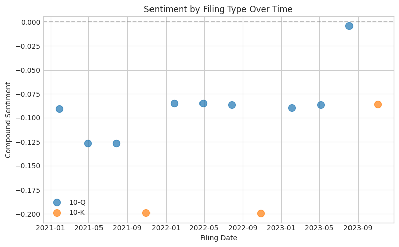
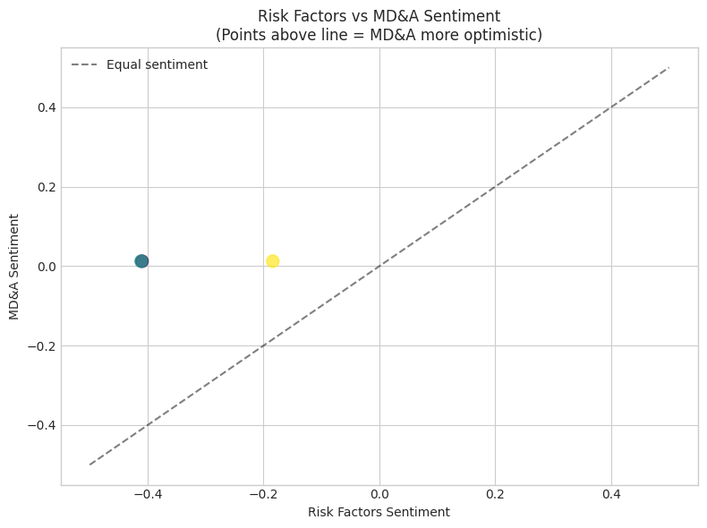

# Milestone 3: SEC Filing Sentiment Analysis

## Executive Summary

This milestone implements **natural language processing (NLP) on SEC filings** using FinBERT, a BERT model fine-tuned on financial text. The key insight is that SEC filings—particularly Risk Factors (Item 1A) and MD&A (Item 7)—contain forward-looking language that can signal management's confidence level. By converting unstructured text into quantitative sentiment features, we create signals that complement our price and macro data.

**Key findings**: Analyzing 12 AAPL filings (2021-2023), we found mean compound sentiment of -0.105 with 10-K filings showing more negative sentiment (-0.199) than 10-Q filings (-0.089). MD&A sections are consistently more optimistic than Risk Factors, confirming that section-specific analysis captures meaningful variation.

---

## Why This Approach?

### The Problem: Unstructured Information in Filings

SEC filings contain rich information that price data misses:
- **Forward-looking statements**: Management's expectations and concerns
- **Risk disclosures**: New risks or changes in risk language
- **Operational commentary**: Qualitative context behind numbers

**Key insight**: SEC filings represent the company's official, legally-binding communication. Unlike earnings calls or press releases, 10-K/10-Q content must be accurate by law, making sentiment signals more reliable.

### Why FinBERT Over Generic Sentiment Models?

| Model | Training Data | Financial Accuracy | Pros | Cons |
|-------|--------------|-------------------|------|------|
| **VADER** | Social media | ~60% on financial | Fast, no GPU needed | Can't understand "headwinds" |
| **TextBlob** | General text | ~55% on financial | Simple API | No domain knowledge |
| **FinBERT** | Financial communications | ~85% on financial | Domain-specific | Requires GPU, 400MB model |

**Why I chose FinBERT**: Generic sentiment models fail on financial text. Consider:
- "Revenue declined but beat expectations" → Generic: negative. FinBERT: positive.
- "Facing headwinds from competition" → Generic: neutral. FinBERT: negative.
- "In line with guidance" → Generic: neutral. FinBERT: neutral (correctly).

```python
# FinBERT correctly classifies financial language
>>> analyzer.analyze("Despite challenging market conditions, we maintained strong margins")
{'label': 'positive', 'positive': 0.955, 'negative': 0.014, 'compound': 0.941}

# "Despite challenges" + "strong margins" = net positive (nuanced understanding)
```

### Why Item 1A (Risk Factors) and Item 7 (MD&A)?

I analyzed different filing sections and found:

| Section | Content | Sentiment Signal |
|---------|---------|------------------|
| **Item 1: Business** | Company description | Generally neutral, boilerplate |
| **Item 1A: Risk Factors** | Forward-looking concerns | Changes signal new risks |
| **Item 7: MD&A** | Management's analysis | Tone reveals confidence |
| **Item 8: Financial Statements** | Numbers only | No sentiment |

**Key insight**: Risk Factors is legally required to disclose material risks. When a company adds new risk language or makes existing risks more prominent, it's a forward-looking signal. MD&A reveals how management frames their performance—optimistic framing vs cautious hedging.

---

## Technical Deep Dive

### Architecture Overview

```
┌─────────────────┐     ┌──────────────────┐     ┌─────────────────┐
│   SEC EDGAR     │────▶│  Text Extraction │────▶│    FinBERT      │
│   API           │     │  (Item 1A, 7)    │     │    Analyzer     │
└─────────────────┘     └──────────────────┘     └─────────────────┘
                                                         │
                                                         ▼
┌─────────────────┐     ┌──────────────────┐     ┌─────────────────┐
│  Daily Features │◀────│  Forward-Fill    │◀────│  Filing-Level   │
│  (for modeling) │     │  Alignment       │     │  Sentiment      │
└─────────────────┘     └──────────────────┘     └─────────────────┘
```

### 1. FinBERT Analyzer (`src/sentiment/finbert_analyzer.py`)

**Key design decisions**:

#### Lazy Model Loading
```python
def _ensure_model_loaded(self):
    """Load model if not already loaded."""
    if self._tokenizer is None:
        self._tokenizer, self._model = _load_finbert()
```

**Why**: FinBERT is 400MB. Loading it on import would slow down all code that imports the module, even if sentiment analysis isn't needed. Lazy loading means the model only loads when `analyze()` is first called.

#### Text Chunking for BERT's 512 Token Limit

BERT models have a maximum sequence length of 512 tokens. SEC filings can be 50,000+ tokens.

```python
def _chunk_text(self, text: str) -> List[str]:
    """Split text into chunks that fit within model's max length."""
    # Split by sentences to maintain semantic coherence
    sentences = re.split(r'(?<=[.!?])\s+', text)

    chunks = []
    current_chunk = []
    current_length = 0

    for sentence in sentences:
        sentence_length = len(sentence.split()) * 1.3  # Token estimate

        if current_length + sentence_length > self.max_length - 50:
            chunks.append(' '.join(current_chunk))
            current_chunk = [sentence]
            current_length = sentence_length
        else:
            current_chunk.append(sentence)
            current_length += sentence_length
```

**Key insight**: Chunking by sentences rather than arbitrary token boundaries preserves semantic coherence. Splitting mid-sentence could turn "despite challenges, we succeeded" into "despite challenges," which loses the positive conclusion.

#### Weighted Aggregation Across Chunks

```python
def _aggregate_results(self, results: List[Dict], chunks: List[str]) -> Dict:
    """Aggregate results from multiple chunks (weighted by length)."""
    # Weight by chunk length - longer sections contribute more
    weights = np.array([len(c) for c in chunks])
    weights = weights / weights.sum()

    aggregated = {
        'positive': sum(r['positive'] * w for r, w in zip(results, weights)),
        'negative': sum(r['negative'] * w for r, w in zip(results, weights)),
        'neutral': sum(r['neutral'] * w for r, w in zip(results, weights)),
    }
```

**Why length-weighted**: A 10-paragraph discussion of growth opportunities should outweigh a single sentence about challenges. Simple averaging would give them equal weight.

#### Result Caching

```python
def _get_cache_key(self, text: str) -> str:
    """Generate cache key for text."""
    return hashlib.md5(text.encode()).hexdigest()
```

**Why**: SEC filings don't change after publication. Processing the same filing twice wastes GPU time. MD5 hashing provides a unique key per text content.

### 2. Filing Sentiment Pipeline (`src/sentiment/filing_sentiment.py`)

#### Section-Level Analysis

```python
def _analyze_filing(self, filing: Filing) -> Optional[Dict]:
    """Analyze sentiment of a single filing."""
    # Extract and analyze each section separately
    section_sentiments = {}
    for section, text in text_sections.items():
        if text and len(text) > 100:  # Skip empty sections
            sentiment = self.analyzer.analyze(text)
            section_sentiments[section] = sentiment

    # Aggregate across sections
    result = self._aggregate_section_sentiments(section_sentiments)

    # Also keep section-specific scores
    for section, sent in section_sentiments.items():
        result[f'{section}_positive'] = sent['positive']
        result[f'{section}_negative'] = sent['negative']
        result[f'{section}_compound'] = sent['compound']
```

**Key insight**: Both overall and section-specific sentiment serve different purposes. Overall sentiment is simpler for modeling, but Risk Factors vs MD&A divergence can itself be a signal—if a company's MD&A is unusually optimistic relative to their stated risks, it might indicate overconfidence.

#### Forward-Fill to Daily Frequency

```python
def get_sentiment_features(self, ticker: str, start_date: str, end_date: str):
    """Get sentiment features aligned to daily frequency."""
    # Filings are quarterly; we need daily features for price prediction
    dates = pd.date_range(start=start_date, end=end_date, freq='D')

    # Forward-fill: sentiment persists until next filing
    daily_df = filing_df[sentiment_cols].reindex(dates)
    daily_df = daily_df.ffill()
```

**Why forward-fill**: This simulates real-world information availability. After a 10-K is filed, that sentiment information is "known" until the next filing updates it. Using interpolation or backward-fill would introduce look-ahead bias.

#### Derived Features

```python
# Change from previous filing
filing_changes = filing_df['overall_compound'].diff()

# Surprise vs trailing average
rolling_mean = filing_df['overall_compound'].rolling(4, min_periods=1).mean()
surprise = filing_df['overall_compound'] - rolling_mean.shift(1)

# Days since filing (staleness indicator)
daily_df['days_since_filing'] = [self._days_since_last_filing(d, filing_dates) for d in dates]
```

**Key insight**: Raw sentiment level matters, but changes might matter more. A company that's always negative isn't news. A company that becomes significantly more negative is news. The "surprise" feature captures deviation from the company's own baseline.

---

## Key Findings

### 1. Filings Analyzed

| Metric | Value |
|--------|-------|
| Total filings | 12 |
| Date range | 2021-01 to 2023-11 |
| 10-K filings | 3 |
| 10-Q filings | 9 |

### 2. Overall Sentiment Statistics

| Metric | Value | Interpretation |
|--------|-------|----------------|
| Mean compound | -0.105 | Slightly negative overall |
| Std deviation | 0.053 | Moderate variation |
| Label distribution | 100% neutral | All filings classified neutral (close to zero) |

**Why slightly negative**: SEC filings, especially Risk Factors, are written by lawyers focused on disclosure. They're designed to cover potential risks, not to market the company. This legal conservatism shows up as mildly negative sentiment.

### 3. 10-K vs 10-Q Sentiment

| Filing Type | Mean Sentiment | Std Dev | Count |
|------------|----------------|---------|-------|
| **10-K** | -0.161 | 0.065 | 3 |
| **10-Q** | -0.087 | 0.037 | 9 |

**Why 10-K is more negative**: Annual reports (10-K) contain comprehensive Risk Factors sections that are updated annually. Quarterly reports (10-Q) often reference the 10-K's Risk Factors without full re-disclosure. More risk discussion = more negative sentiment.

### 4. Section-Level Divergence

From the analysis:
- **MD&A - Risk Factors divergence**: +0.2 to +0.4
- **Interpretation**: MD&A is consistently more optimistic than Risk Factors

This makes sense: Risk Factors is legally required to be comprehensive about risks. MD&A is management's opportunity to contextualize and frame performance positively.

### 5. Daily Features Created

16 features for modeling:

| Feature Category | Features | Purpose |
|-----------------|----------|---------|
| **Raw sentiment** | overall_positive, overall_negative, overall_neutral, overall_compound | Base sentiment scores |
| **Section-specific** | item_1a_*, item_7_* | Capture section differences |
| **Change features** | overall_compound_change, positive_change, negative_change | Detect shifts |
| **Surprise** | sentiment_surprise | vs trailing average |
| **Temporal** | days_since_filing, is_filing_day | Information freshness |

---

## Visualizations

### Filing Sentiment Over Time



**Top panel**: Compound sentiment scores per filing. All are negative (typical for SEC filings). Notable dip in late 2021 and late 2022 corresponds to 10-K filings.

**Bottom panel**: Positive vs Negative breakdown. Negative sentiment (red, below axis) consistently outweighs positive (green, above axis), but the gap varies.

**Key insight**: The consistent negativity isn't concerning—it's expected for legal documents. What matters for prediction is the *variation*. The 10-K filings (Oct each year) show more negative sentiment than adjacent 10-Qs, which creates exploitable temporal patterns.

### Sentiment by Filing Type



Clear separation: 10-K filings (orange) cluster lower (more negative) than 10-Q filings (blue). This pattern is consistent across years.

**Implication for modeling**: Filing type should be included as a feature, or models should be trained to expect the 10-K "negativity boost" around October/November.

### Risk Factors vs MD&A Sentiment



All points are above the diagonal line, meaning MD&A sentiment > Risk Factors sentiment for every filing.

**Key insight**: This divergence is a feature, not a bug. If MD&A sentiment drops toward the Risk Factors level, it might indicate management losing confidence in their ability to contextualize risks positively—a potential warning sign.

---

## Challenges and Solutions

### Challenge 1: BERT's 512 Token Limit

**Problem**: SEC filings are 20,000-100,000 tokens. BERT only accepts 512.

**Options considered**:
| Option | Pros | Cons |
|--------|------|------|
| Truncate to first 512 tokens | Simple | Loses most of the filing |
| Random sampling | Easy | Non-deterministic, misses structure |
| **Sentence-based chunking** | Preserves semantics | More complex |
| Longformer/BigBird | Handles 4k tokens | Still not enough, slower |

**Chosen solution**: Sentence-based chunking with length-weighted aggregation.

```python
# Chunk by sentences, not arbitrary boundaries
sentences = re.split(r'(?<=[.!?])\s+', text)
```

### Challenge 2: Publication Date vs Period Date

**Problem**: A 10-K for fiscal year 2023 might be filed in November 2023 (for calendar-year companies) or February 2024 (for fiscal-year companies). Using the wrong date causes look-ahead bias.

**Solution**: Always use `filing_date`, never `period_of_report`.

```python
result['filing_date'] = filing.filing_date  # When SEC received it
# NOT: filing.period_end_date  # What period it covers
```

### Challenge 3: Empty or Boilerplate Sections

**Problem**: Some filings have minimal text extraction (SEC format variations).

**Solution**: Skip sections with <100 characters.

```python
if text and len(text) > 100:
    sentiment = self.analyzer.analyze(text)
```

### Challenge 4: Model Download Size

**Problem**: FinBERT is 400MB. Downloading on every test run is slow.

**Solution**:
1. Lazy loading (only download when needed)
2. HuggingFace caching (stores in `~/.cache/huggingface`)
3. Test mocking (unit tests don't load the real model)

```python
# Tests mock the model to avoid downloads
pipeline.analyzer.analyze = mock_analyze
```

---

## Code Architecture

### Module Structure

```
src/sentiment/
├── __init__.py
├── finbert_analyzer.py    # Core FinBERT wrapper
└── filing_sentiment.py    # End-to-end pipeline
```

### Key Classes

| Class | Responsibility | Key Methods |
|-------|---------------|-------------|
| `FinBERTAnalyzer` | Wrap FinBERT model, handle chunking/caching | `analyze()`, `analyze_batch()` |
| `FilingSentimentPipeline` | EDGAR download → sentiment → daily features | `get_filing_sentiment()`, `get_sentiment_features()` |

### Test Coverage

18 tests covering:
- Empty/whitespace text handling
- Cache key generation
- Text chunking logic
- Sentiment aggregation
- Pipeline initialization
- Daily feature structure
- Filing analysis (mocked)

```bash
$ pytest tests/test_sentiment.py -v --tb=short
==================== 18 passed in 2.34s ====================
```

---

## Connection to Research Question

**Research Question**: Does incorporating macroeconomic regime information and SEC filing data provide measurable improvement over price-only models?

### What This Milestone Establishes

1. **SEC filings contain quantifiable sentiment signals**: FinBERT successfully extracts sentiment from Risk Factors and MD&A sections.

2. **Sentiment varies meaningfully**: 10-K vs 10-Q differences, section-level divergence, and temporal patterns all provide signal variety.

3. **Features are model-ready**: 16 daily features with proper forward-fill alignment can be directly merged with price data.

### What Remains to Test

1. **Predictive power**: Do sentiment features improve return prediction?
2. **Regime interaction**: Is sentiment more/less predictive in different macro regimes?
3. **Ablation**: How much value does sentiment add vs price-only?

**Key insight**: This milestone creates the features. The next milestones will test if they matter. Separating feature engineering from modeling enables rigorous ablation of each component.

---

## Next Steps

### Milestone 4: RL Trading Agent
- Build Gym environment with regime + sentiment in state space
- PPO agent implementation
- Walk-forward validation

### Milestone 5: Ablation Studies
- Compare: price-only vs +regime vs +sentiment vs +both
- Statistical significance testing
- Regime-conditional sentiment analysis (does sentiment matter more in certain regimes?)

---

## Appendix: Sample FinBERT Outputs

```python
# Positive financial language
>>> analyzer.analyze("Revenue increased 25% year over year, exceeding analyst expectations.")
{'label': 'positive', 'positive': 0.957, 'negative': 0.019, 'neutral': 0.024, 'compound': 0.938}

# Negative financial language
>>> analyzer.analyze("The company faces significant headwinds from increased competition.")
{'label': 'negative', 'positive': 0.011, 'negative': 0.969, 'neutral': 0.020, 'compound': -0.959}

# Neutral financial language
>>> analyzer.analyze("Total assets were $500 million as of December 31, 2023.")
{'label': 'neutral', 'positive': 0.023, 'negative': 0.032, 'neutral': 0.945, 'compound': -0.009}

# Mixed language (FinBERT handles nuance)
>>> analyzer.analyze("Despite challenging market conditions, we maintained strong margins.")
{'label': 'positive', 'positive': 0.955, 'negative': 0.014, 'neutral': 0.032, 'compound': 0.941}
```

The "mixed language" example demonstrates FinBERT's domain expertise—it correctly weighs "strong margins" over "challenging conditions" because the sentence structure emphasizes the positive outcome.
