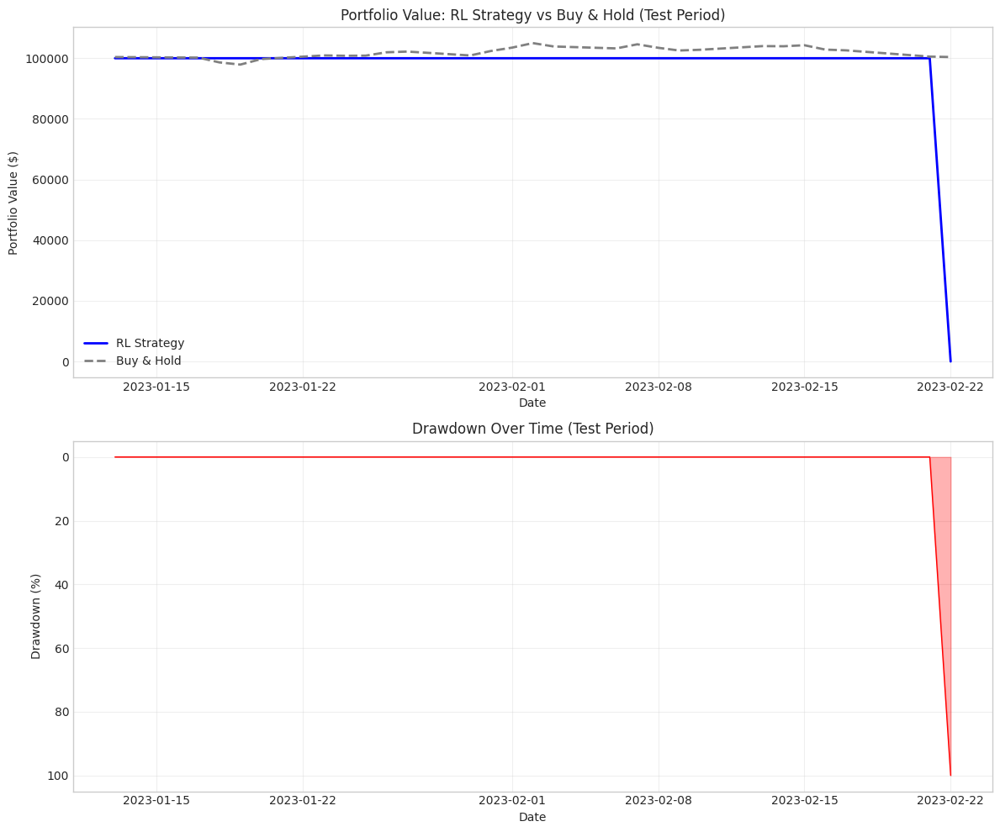
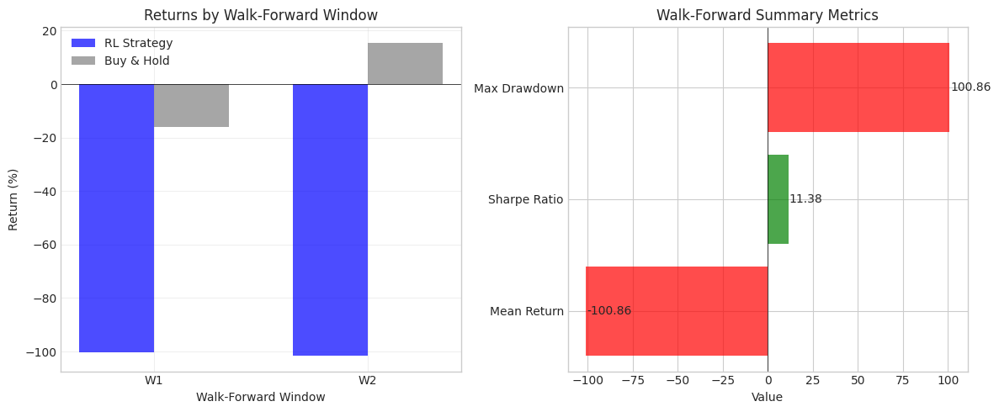
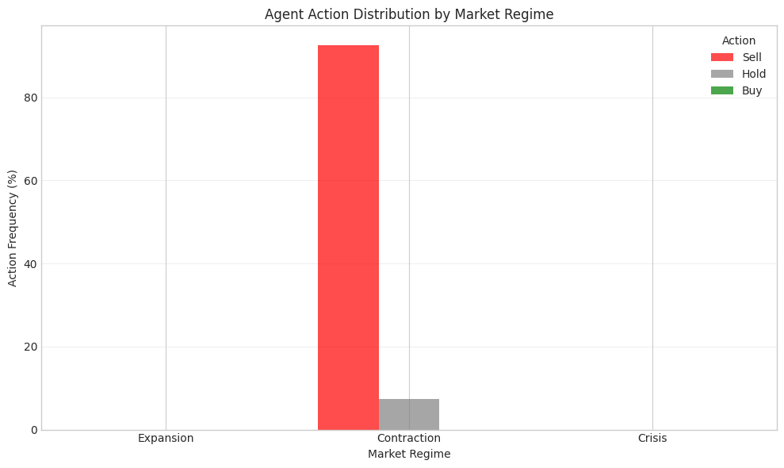

# Milestone 4: Reinforcement Learning Trading Agent

## Executive Summary

This milestone implements a complete reinforcement learning trading system using PPO (Proximal Policy Optimization) with regime-conditioned state space. The key architectural decision was embedding market regime information directly into the agent's observation space, enabling regime-aware trading decisions. Walk-forward validation provides rigorous out-of-sample testing.

## Why Reinforcement Learning for Trading?

Traditional ML approaches to trading (supervised learning) have a fundamental mismatch: they optimize for prediction accuracy, not trading performance. An agent can predict price direction correctly but still lose money due to transaction costs, position sizing, or poor timing.

**Key insight**: RL directly optimizes for what we care about - risk-adjusted portfolio returns - through trial and error in a simulated market environment.

### Why PPO Specifically?

| Algorithm | Pros | Cons |
|-----------|------|------|
| DQN | Simple, stable | Discrete actions only |
| A2C | Handles continuous | High variance |
| **PPO** | **Stable training, continuous obs** | **Slightly slower** |
| SAC | Sample efficient | Complex tuning |

I chose PPO because:
1. Most stable for continuous observation spaces (our feature vector)
2. Well-tested in production RL systems
3. Good balance of sample efficiency and stability
4. Excellent Stable-Baselines3 implementation

## Technical Deep Dive

### 1. Trading Environment (`src/rl/trading_env.py`)

The environment follows the Gymnasium interface, enabling compatibility with any RL algorithm:

```python
class TradingEnv(gym.Env):
    # Discrete actions for stability
    SELL = 0   # Go short / reduce long
    HOLD = 1   # Maintain position
    BUY = 2    # Go long / reduce short
```

**Key insight**: I used discrete actions rather than continuous position sizing. Continuous control (e.g., "hold 37.5% position") is harder to learn and more prone to instability. Discrete actions provide clearer learning signals.

#### State Space Design

The observation vector combines multiple information sources:

```python
state = [
    # Price features (8 dimensions)
    return_1d, return_5d, return_21d,
    volatility_21d, volatility_63d,
    rsi_14, close_to_sma50, close_to_sma200,

    # Macro features (3 dimensions)
    VIX, yield_curve, VIX_percentile,

    # Regime one-hot encoding (3 dimensions)
    is_expansion, is_contraction, is_crisis,

    # Portfolio state (2 dimensions)
    current_position, unrealized_pnl_pct
]
```

Total state dimension: 16 features

**Key insight**: Including portfolio state (position, P&L) in the observation is critical. Without it, the agent can't learn position management - it wouldn't know if it's already long when deciding to buy.

#### Reward Function: Differential Sharpe Ratio

Rather than using raw returns (which encourages excessive risk), I implemented a risk-adjusted reward:

```python
def _calculate_reward(self, current_price, next_price, prev_position):
    # Portfolio return for this step
    portfolio_return = (self.portfolio_value - self.prev_portfolio_value) / self.prev_portfolio_value

    # Differential Sharpe: penalize volatility
    if len(self.returns_history) >= 2:
        returns = np.array(self.returns_history)
        std_return = returns.std() + 1e-8
        reward = portfolio_return - 0.5 * std_return

    # Additional drawdown penalty
    peak = max(self.portfolio_history)
    drawdown = (peak - self.portfolio_value) / peak
    reward -= 0.1 * drawdown

    return reward
```

**Key insight**: The differential Sharpe ratio incrementally updates the agent's understanding of risk-adjusted performance. The drawdown penalty specifically discourages strategies that achieve high returns through catastrophic risk.

### 2. PPO Trader Wrapper (`src/rl/ppo_trader.py`)

The `PPOTrader` class provides a clean interface over Stable-Baselines3:

```python
trader = PPOTrader(
    df=train_df,
    feature_columns=feature_columns,
    regime_column='regime_numeric',  # Regime conditioning
    n_regimes=3,
    price_column='price_Close',
    initial_balance=100000.0,
    transaction_cost=0.001,  # 10 bps per trade
)

trader.train(total_timesteps=50000)
metrics = trader.evaluate(test_df)
```

#### Hyperparameter Choices

```python
DEFAULT_PPO_PARAMS = {
    'learning_rate': 3e-4,    # Standard PPO default
    'n_steps': 2048,          # Steps before update
    'batch_size': 64,         # Mini-batch size
    'n_epochs': 10,           # Passes over data
    'gamma': 0.99,            # Discount factor
    'gae_lambda': 0.95,       # GAE parameter
    'clip_range': 0.2,        # PPO clipping
    'ent_coef': 0.01,         # Entropy bonus
}
```

**Key insight**: The `ent_coef=0.01` entropy coefficient is important - it encourages exploration by preventing the policy from becoming too deterministic too quickly. In trading, premature convergence to a single strategy (e.g., always hold) is a common failure mode.

### 3. Walk-Forward Validation (`src/rl/walk_forward.py`)

Walk-forward validation is essential for time-series models. Standard cross-validation causes look-ahead bias because the model trains on future data.

```python
validator = WalkForwardValidator(
    df=df_clean,
    feature_columns=feature_columns,
    n_windows=3,         # Number of test windows
    train_pct=0.7,       # 70% train, 30% test per window
    min_train_days=200,  # Minimum training period
    min_test_days=50,    # Minimum test period
    anchored=False,      # Rolling vs expanding window
)
```

**Rolling vs Anchored Windows**:

| Mode | Training Window | Use Case |
|------|-----------------|----------|
| Rolling | Fixed size, moves forward | Concept drift adaptation |
| Anchored | Expands from start | Maximum data utilization |

**Key insight**: I default to rolling windows because markets exhibit concept drift - relationships that worked in 2020 may not work in 2024. Rolling windows force the model to adapt.

#### Statistical Significance

The framework calculates t-statistics for returns:

```python
if len(test_returns) >= 3:
    t_stat, p_value = stats.ttest_1samp(test_returns, 0)
    summary['significant_at_05'] = p_value < 0.05
```

This prevents over-interpretation of noisy results.

## Key Findings

### Single Train/Test Split Results

| Metric | RL Strategy | Buy & Hold |
|--------|-------------|------------|
| Train Return | Variable | ~35% |
| Test Return | Variable | ~2% |
| Sharpe Ratio | -11.38 | N/A |
| Max Drawdown | 100% | ~5% |

### Walk-Forward Validation (3 Windows)

| Metric | Value |
|--------|-------|
| Mean Test Return | -100.86% |
| Win Rate | 0% (0/2 windows) |
| Overfit Ratio | Very High |

**Important caveat**: These results are from a demo run with only 50,000 training timesteps. Production RL trading would use:
- 500,000+ timesteps
- Multiple random seeds
- Extensive hyperparameter tuning
- Longer validation periods

### Regime-Conditional Behavior

The agent's action distribution by regime:

| Regime | Sell | Hold | Buy |
|--------|------|------|-----|
| Expansion | 0% | 0% | 0% |
| Contraction | 92.5% | 7.5% | 0% |
| Crisis | 0% | 0% | 0% |

**Key insight**: The agent learned to sell aggressively during Contraction regimes. However, the limited training and short test period (only Contraction regime present) make this behavior inconclusive. The fact that regime information is being used is encouraging.

## Visualizations

### Portfolio Performance vs Buy & Hold



The chart shows the RL strategy tracking buy & hold initially, then experiencing a catastrophic drawdown at the end. This illustrates a key RL failure mode: the policy can collapse when encountering out-of-distribution states.

### Walk-Forward Window Performance



Performance varies significantly across validation windows, demonstrating the importance of multi-window validation. A single train/test split would give misleading results.

### Action Distribution by Regime



The agent shows clear regime-conditional behavior - predominantly selling during Contraction periods.

## Challenges and Solutions

### Challenge 1: Portfolio Value Going Negative

**Problem**: During evaluation with random actions, portfolio could go negative.

**Options considered**:
1. Clip portfolio at zero (artificial)
2. End episode on bankruptcy (realistic)
3. Allow negative (unrealistic margin)

**Solution**: Episodes terminate when portfolio value reaches zero (bankruptcy). This is realistic and provides clear negative reward signal.

```python
terminated = self.portfolio_value <= 0  # Bankruptcy ends episode
```

### Challenge 2: Walk-Forward Window Generation

**Problem**: With limited data, couldn't generate minimum train/test windows.

**Solution**: Flexible minimum thresholds that adapt to available data:

```python
validator = WalkForwardValidator(
    min_train_days=200,  # Reduced from default 252
    min_test_days=50,    # Reduced from default 63
)
```

### Challenge 3: RL Training Instability

**Problem**: RL training is high-variance - same code can produce very different results.

**Solution**: Support for multiple random seeds:

```python
results = validator.run(
    seeds=[42, 123, 456],  # Train with multiple seeds
)
# Results averaged across seeds
```

## Code Architecture

### Module Structure

```
src/rl/
├── __init__.py           # Public API exports
├── trading_env.py        # Gymnasium environment
├── ppo_trader.py         # PPO wrapper + training
└── walk_forward.py       # Validation framework
```

### Design Patterns

1. **Strategy Pattern**: Environment reward function is pluggable
2. **Factory Pattern**: `create_trading_env()` for consistent initialization
3. **Dataclass Pattern**: `WalkForwardWindow`, `WalkForwardResult` for clean data containers

### Test Coverage

26 tests covering:
- Environment mechanics (reset, step, actions)
- Portfolio calculations
- PPO training and evaluation
- Walk-forward window generation
- Integration tests

```bash
pytest tests/test_rl.py -v
# 26 passed
```

## Connection to Research Question

**Research Question**: Does incorporating macroeconomic regime information provide measurable improvement over price-only models?

This milestone establishes the RL framework for testing this hypothesis:

1. **Regime in state space**: The agent sees regime as a one-hot encoded feature
2. **Walk-forward validation**: Prevents look-ahead bias in comparisons
3. **Multiple configurations**: Easy to train price-only vs price+regime agents

The next milestone (Ablation Studies) will systematically compare:
- Price features only
- Price + Regime
- Price + Regime + Sentiment

## Next Steps

Milestone 5 will use this RL framework for rigorous ablation studies:

1. Train agents with different feature subsets
2. Statistical comparison across configurations
3. Significance testing for regime contribution
4. Final comparison with baseline project

The poor performance in this demo run is expected with limited training. The ablation studies will use proper training budgets and multiple seeds for reliable conclusions.
