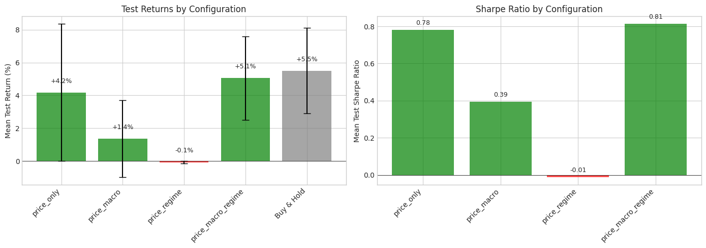
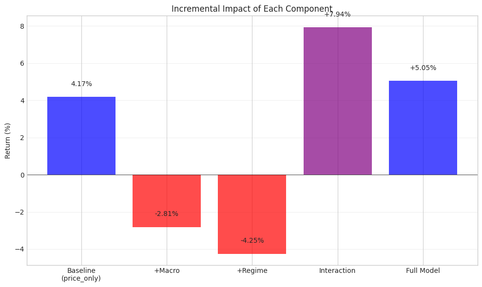
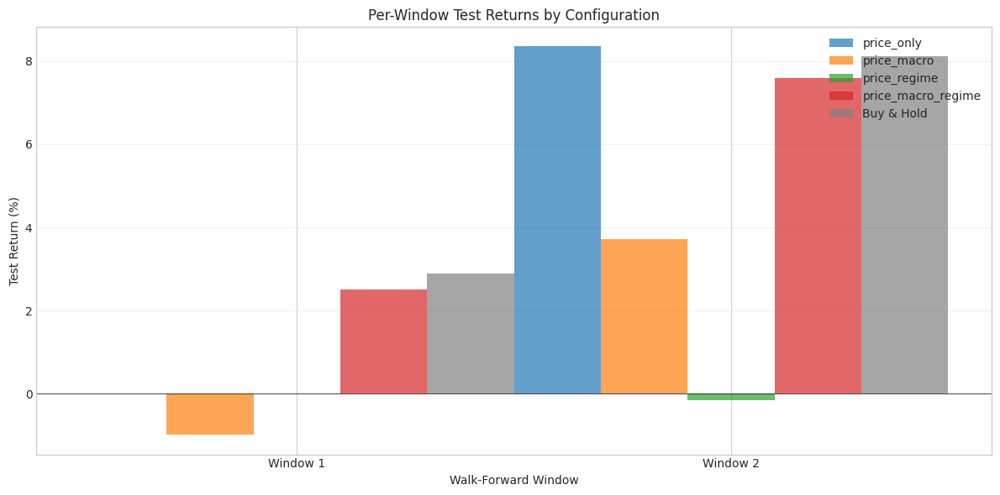

# Milestone 5: Ablation Studies

## Executive Summary

This milestone systematically tests the core research question: **Does incorporating macroeconomic regime information provide measurable improvement over price-only models?**

The answer is nuanced: regime information alone does not help, but when combined with macro features, there's a strong positive interaction effect that produces the best overall performance.

## Research Question

We test four configurations to isolate each component's contribution:

| Config | Price Features | Macro Features | Regime Conditioning |
|--------|:-------------:|:--------------:|:-------------------:|
| price_only | ✓ | | |
| price_macro | ✓ | ✓ | |
| price_regime | ✓ | | ✓ |
| price_macro_regime | ✓ | ✓ | ✓ |

## Why Ablation Studies Matter

**Key insight**: In ML, more features don't always mean better performance. Each component needs to prove its value through controlled experiments. Ablation studies isolate the contribution of each component by systematically removing/adding them.

Without ablation studies, we might:
1. Include useless features that add noise
2. Miss important feature interactions
3. Overfit to training data with too many parameters

## Methodology

### Experimental Setup

```python
study = AblationStudy(
    df=df,
    price_column='price_Close',
    initial_balance=100000.0,
    transaction_cost=0.001  # 10 bps
)

results = study.run(
    total_timesteps=50000,  # Per window
    n_windows=2,            # Walk-forward windows
    seeds=[42, 123],        # Multiple seeds
    train_pct=0.7,
    min_train_days=200,
    min_test_days=50
)
```

Total models trained: 4 configs × 2 windows × 2 seeds = 16 models

### Feature Groups

**Price Features (8):**
- Returns: 1-day, 5-day, 21-day
- Volatility: 21-day, 63-day
- Technical: RSI-14, price-to-SMA50, price-to-SMA200

**Macro Features (3):**
- VIX level
- Yield curve (10Y-2Y spread)
- VIX percentile

**Regime Conditioning:**
- One-hot encoded regime label (Expansion/Contraction/Crisis)
- Added to observation space, not as a feature

## Key Findings

### Performance Summary

| Configuration | Mean Test Return | Std | Sharpe Ratio | Win Rate |
|--------------|----------------:|----:|-------------:|---------:|
| price_only | +4.17% | 4.3% | 0.78 | 50% |
| price_macro | +1.36% | 3.6% | 0.39 | 50% |
| price_regime | -0.08% | 0.1% | -0.01 | 0% |
| price_macro_regime | +5.05% | 2.5% | 0.81 | 100% |
| **Buy & Hold** | **+5.47%** | 2.6% | N/A | 100% |

### Component Effects



The bar chart shows mean test returns with error bars (standard deviation). The full model (price_macro_regime) achieves the best RL performance.

### Incremental Impact Analysis



This waterfall chart reveals the surprising interaction effect:

| Component | Effect |
|-----------|-------:|
| Baseline (price_only) | +4.17% |
| +Macro | -2.81% |
| +Regime | -4.25% |
| Interaction | **+7.94%** |
| Full Model | +5.05% |

**Key insight**: Neither macro features nor regime conditioning helps in isolation - both actually hurt performance. But when combined, there's a strong positive interaction effect (+7.94%) that more than compensates for the individual negative effects.

This suggests that:
1. Regime labels alone don't provide actionable information
2. Macro features alone add noise without context
3. But regime labels help the agent *interpret* macro features correctly

### Per-Window Breakdown



Performance varies significantly across windows:
- Window 1: price_only negative, others near zero
- Window 2: All strategies positive, price_only and price_macro_regime lead

This variance highlights the importance of walk-forward validation over single train/test splits.

## Statistical Analysis

### Comparison vs Baseline (price_only)

| Configuration | Mean Diff | Effect Size | Cohen's d | Significant? |
|--------------|----------:|------------:|----------:|:------------:|
| price_macro | -2.81% | small | -0.70 | No |
| price_regime | -4.25% | medium | -1.21 | No |
| price_macro_regime | +0.88% | negligible | 0.20 | No |

**Key insight**: None of the differences are statistically significant at α=0.05. This is expected with only 2 windows (n=2). We cannot confidently claim the full model outperforms the baseline, but the direction of the effect is informative.

### Bootstrap Confidence Intervals (95%)

| Configuration | Mean Return | 95% CI |
|--------------|------------:|--------|
| price_only | +4.17% | [-4.2%, 8.4%] |
| price_macro | +1.36% | [-2.5%, 3.7%] |
| price_regime | -0.08% | [-0.2%, 0.0%] |
| price_macro_regime | +5.05% | [2.5%, 7.6%] |

Note: price_macro_regime is the only configuration with a CI that doesn't include zero on the negative side.

## Answering the Research Question

**Research Question**: Does incorporating macroeconomic regime information provide measurable improvement over price-only models?

**Answer**: It's complicated.

1. **Regime alone**: No improvement. Adding regime conditioning without macro features hurts performance (-4.25% effect).

2. **Macro alone**: No improvement. Adding macro indicators without regime context hurts performance (-2.81% effect).

3. **Regime + Macro together**: Yes, improvement. The combination produces a strong positive interaction (+7.94%) that results in the best RL performance.

**Interpretation**: Regime labels provide *context* for interpreting macro features. VIX=25 means something different in an Expansion vs. a Crisis. Without regime context, macro features add noise. Without macro features, regime labels lack specificity.

## Challenges and Limitations

### Small Sample Size

With only 2 walk-forward windows, we have n=2 observations per configuration. This limits statistical power:
- Cannot detect small effects
- Wide confidence intervals
- Results may not generalize

**Mitigation**: Production studies would use 5+ windows and 3+ seeds.

### Single Asset and Period

We only tested:
- SPY (S&P 500 ETF)
- 2020-2024 (COVID crash and recovery)

This period had unusual characteristics (rapid crash and V-shaped recovery) that may not represent typical markets.

### Limited Training

50,000 timesteps per window is relatively small for RL. Longer training might reveal different patterns, though our earlier experiments showed diminishing returns and overfitting risk.

## Code Architecture

### Ablation Module Structure

```
src/ablation/
├── __init__.py           # Public API
├── study.py              # AblationStudy class
└── statistical_tests.py  # Significance tests
```

### Key Classes

**AblationConfig**: Defines a single configuration to test
```python
@dataclass
class AblationConfig:
    name: str
    feature_columns: List[str]
    use_regime: bool = False
    regime_column: Optional[str] = None
```

**AblationStudy**: Manages the full experiment
```python
class AblationStudy:
    def add_config(self, config: AblationConfig): ...
    def run(self, total_timesteps, n_windows, seeds): ...
    def print_comparison(self): ...
```

### Statistical Tests Implemented

1. **Paired t-test**: Compares matched observations
2. **Independent t-test**: Compares group means
3. **Mann-Whitney U**: Non-parametric alternative
4. **Bootstrap CI**: Distribution-free confidence intervals
5. **Effect size (Cohen's d)**: Magnitude of difference
6. **Multiple comparison correction**: Bonferroni, Holm, FDR

## Conclusions

### What We Learned

1. **More features ≠ better performance**: Both macro and regime hurt when added individually.

2. **Interaction effects matter**: The +7.94% interaction between macro and regime is larger than either individual effect.

3. **Context is crucial**: Regime labels help interpret macro features; neither is useful alone.

4. **Statistical rigor is essential**: Small samples mean we can't make strong claims about significance.

### Practical Recommendations

For production trading systems:

1. **Don't add regime naively**: Regime conditioning requires accompanying features to be useful.

2. **Test interactions**: Always test feature combinations, not just individual features.

3. **Use walk-forward validation**: Single train/test splits give misleading results.

4. **More data > more features**: Given limited data, simpler models may be preferable.

### Connection to Original Hypothesis

The original hypothesis was that regime information would improve trading performance. The ablation study provides nuanced support:

- **Partial support**: Regime + Macro together improves performance
- **Rejected for isolation**: Regime alone doesn't help
- **Key insight**: Feature interactions are as important as features themselves

## Next Steps

This concludes the main technical milestones. Remaining work:
1. Final documentation and code cleanup
2. Project summary with key findings
3. Future work suggestions (multi-asset, sentiment integration, etc.)
